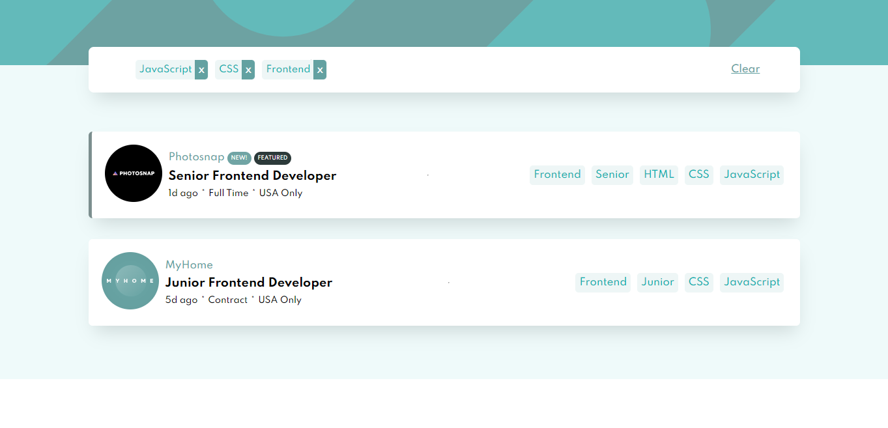
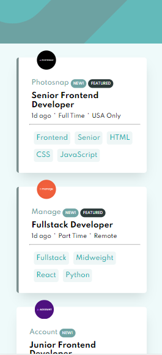

# Frontend Mentor - Job listings with filtering

## Welcome! 👋

Thanks for checking out my this projects, let's have fun.

[Frontend Mentor](https://www.frontendmentor.io) challenges help you improve your coding skills by building realistic projects.

## Overview

This is a frontend coding challenge to help you improve your coding skills... This is an interesting and challenging project I might add, without further ado, let's get started

## The challenge

The challenge is to build out this job listing page and get it looking as close to the design as possible.

You can use any tools you like to help you complete the challenge. So if you've got something you'd like to practice, feel free to give it a go.

Your users should be able to:

- View the optimal layout for the site depending on their device's screen size
- See hover states for all interactive elements on the page
- Filter job listings based on the categories

### Screenshot

### mobile screenshot

### Links

- Solution URL: [solution](https://www.frontendmentor.io/solutions/react-job-listing-with-filtering-_TeWqNka8)
- Live Site URL: [live site](https://myjob-listing-react.netlify.app/);

## My process

**this project was created with "create-react-app"** from React: a frontend library for creating beautiful and interactive web applications.

> Handle the state and data presentation with React Hooks such as usestate, and useEffect hooks, and also props to pass data to child components
> Filtering and other operation with function and array methods like filter, indexOf, push and some methods.

### Built with

- Semantic HTML5 markup
- CSS custom properties
- Flexbox
- CSS Grid
- Mobile-first workflow
- [React](https://reactjs.org/) - JS library

### What I learned

A mini project, a great one i might add... It had me thinking in React, how to concatenate multiply arrays with primitive values, using React hooks, passing props and decomposing the entire app structure to fit in the React workflow. It an awesome challenge thanks to fronendmentor.io for providing this one.

## Author

- Website - [Add your name here](https://ebukaeze.netlify.app)
- Frontend Mentor - [@kingbaddo](https://www.frontendmentor.io/profile/kingbaddo)
- Twitter - [@vikkzero](https://www.twitter.com/vikkzero)

## Deploying your project

As mentioned above, there are many ways to host your project for free. Our recommend hosts are:

- [GitHub Pages](https://pages.github.com/)
- [Vercel](https://vercel.com/)
- [Netlify](https://www.netlify.com/)

You can host your site using one of these solutions or any of our other trusted providers. [Read more about our recommended and trusted hosts](https://medium.com/frontend-mentor/frontend-mentor-trusted-hosting-providers-bf000dfebe).

**Have fun building!** 🚀
